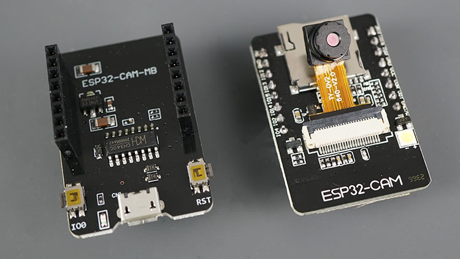

# 1단계 — Arduino IDE 설정


ESP32-CAM은 USB가 없어서 **USB-UART 변환기**가 필수입니다. 가장 흔한 두 방법:

- **ESP32-CAM-MB 어댑터** — 보드 밑에 끼우면 USB-C/Micro USB로 바로 연결 (가장 편함)
- **FTDI / CP2102 모듈** — 점퍼선으로 직접 연결 (저렴, 회로 이해에 좋음)

## 1. Arduino IDE 설치

- https://www.arduino.cc/en/software 에서 IDE 2.x 버전 다운로드 (Windows / macOS / Linux)
- 설치 후 실행

## 2. ESP32 보드 매니저 추가

1. `File` → `Preferences`
2. **Additional Boards Manager URLs** 에 아래 추가:
   ```
   https://espressif.github.io/arduino-esp32/package_esp32_index.json
   ```
3. `Tools` → `Board` → `Boards Manager` → "esp32" 검색 → **esp32 by Espressif Systems**
4. **버전 선택이 매우 중요** — 드롭다운에서 **2.0.17** 선택 후 INSTALL

> ⚠ **3.x 절대 피하기 (실전 경험)**
> 최신 3.3.x 는 ESP32-CAM AI Thinker 보드에서:
> - 빌드 캐시 충돌로 `undefined reference to 'Serial0' / 'ESP' / 'delay'` 같은 링커 에러를 뱉음
> - PSRAM 메뉴가 사라지고 자동 설정으로 바뀌면서 카메라 init이 조용히 멈춤
> - CameraWebServer의 **얼굴 인식 기능이 제거됨** (esp-face 라이브러리 단종)
>
> **2.0.17** 이 가장 안정적이고 7단계 얼굴 인식까지 그대로 따라갈 수 있어요.

### 이미 3.x 가 설치돼 있다면 (실제로 막혔던 케이스)

1. Arduino IDE 종료
2. 다음 두 폴더 **통째로 삭제** (캐시 비우기):
   - Windows: `C:\Users\<사용자>\AppData\Local\arduino\sketches\`
   - Windows: `C:\Users\<사용자>\AppData\Local\arduino\cores\`
   - macOS: `~/Library/Caches/arduino/`
3. IDE 열기 → Boards Manager → esp32 옆 **REMOVE** → IDE 재시작
4. Boards Manager → esp32 → 버전 **2.0.17** 선택 → INSTALL
5. 보드/파티션 다시 설정 후 컴파일

## 3. 보드 선택

- `Tools` → `Board` → `ESP32 Arduino` → **AI Thinker ESP32-CAM**
- `Tools` → `Partition Scheme` → **Huge APP (3MB No OTA/1MB SPIFFS)** (카메라 라이브러리 용량 때문)
- `Tools` → `PSRAM` → **Enabled** ← 2.0.17 에서는 메뉴에 보임. 3.x는 자동
- `Tools` → `Upload Speed` → 처음엔 **115200** ← **460800/921600은 ESP32-CAM에서 `Invalid head of packet` 에러 잘 남**
- `Tools` → `Erase All Flash Before Sketch Upload` → 평소 **Disabled**, 문제 생기면 한 번만 Enabled
- `Tools` → `Port` → USB-UART가 잡힌 COM/tty 선택

## 4. USB-UART 드라이버

| 칩 | 드라이버 |
|---|---|
| CH340 | wch.cn 또는 sparkfun 가이드 |
| CP2102 / CP2104 | Silicon Labs CP210x VCP Drivers |
| FTDI FT232 | FTDI VCP Drivers |

macOS는 보안설정에서 커널 확장 허용이 필요할 수 있음. Linux는 보통 별도 설치 불필요 (`/dev/ttyUSB0`).

## 5. 업로드 절차

ESP32-CAM은 **자동 부트가 안 됨** — 매번 수동으로 부트 모드 진입시켜야 합니다.

### A. ESP32-CAM-MB 어댑터 또는 IO0 버튼이 있는 보드 (가장 흔함)

**업로드**:
1. **IO0 버튼을 누른 채로** 유지
2. (선택) RESET 버튼 짧게 한 번 — IO0는 계속 누른 상태
3. Arduino IDE에서 **Upload** 클릭
4. "Writing... 100%" 나 `Hash of data verified` 가 보일 때까지 IO0 계속 누름
5. 업로드 완료되면 IO0 떼기
6. **RESET 버튼 짧게 한 번** → 일반 모드 부팅, 스케치 실행 시작

> 💡 시리얼 모니터에 `boot:0x12 SPI_FAST_FLASH_BOOT` 가 나오면 정상 부팅.
> `boot:0x3 DOWNLOAD_BOOT` + `waiting for download` 가 나오면 부트 모드에 갇힌 것 → IO0 안 누른 채로 RESET만 다시 누름.

### B. FTDI / CP2102 모듈로 직접 연결

```
FTDI          ESP32-CAM
─────         ──────────
5V    ────►   5V
GND   ────►   GND
TX    ────►   U0R (GPIO3)
RX    ────►   U0T (GPIO1)
              GPIO0 ─── GND  (업로드 모드 진입용 점프)
```

**업로드 절차**:
1. `GPIO0`와 `GND`를 연결 (점퍼선)
2. RESET 버튼 누르기 (또는 전원 재인가)
3. Arduino IDE에서 **Upload** 클릭
4. "Connecting..." 점 찍히는 동안 대기
5. 업로드 끝나면 `GPIO0` ↔ `GND` **분리**하고 RESET → 일반 동작 모드

## 6. 동작 확인 체크리스트

- [ ] Arduino IDE 설치 완료
- [ ] esp32 보드 패키지 설치 완료
- [ ] 보드/포트/PSRAM/파티션 설정 완료
- [ ] USB-UART 드라이버 인식 (장치 관리자 / `ls /dev/tty*`)
- [ ] FTDI 사용 시 GPIO0-GND 점퍼 준비

여기까지 되면 → `02_first_blink` 로 이동.

## 자주 막히는 곳 (실전에서 부딪힌 것들)

- **`undefined reference to 'Serial0' / 'ESP' / 'delay'`** (컴파일 단계) → esp32 코어 3.x 캐시 깨짐. 위 ⚠ 박스 따라 2.0.17 다운그레이드 + 캐시 폴더 삭제
- **`Invalid head of packet (0x..): Possible serial noise or corruption`** → Upload Speed 너무 빠름. **115200** 으로 낮춤
- **"A fatal error occurred: Failed to connect to ESP32"** → IO0 안 누르고 업로드 시도, 또는 RESET 타이밍, 또는 5V 전원 부족
- **`boot:0x3 DOWNLOAD_BOOT` + `waiting for download`** → IO0 누른 채로 RESET 했음 → IO0 떼고 RESET만 다시 누름
- **업로드 성공인데 시리얼이 조용함** → IO0 떼고 RESET 한 번 안 누름. 또는 시리얼 모니터 baud ≠ 115200
- **"Brownout detector was triggered"** → 5V 전원이 약함. PC USB 직결, 짧고 굵은 케이블, 안 되면 외부 5V/2A
- **포트가 안 보임** → USB-UART 드라이버 미설치 (CH340 / CP210x / FTDI)
- **자세한 진단** → `docs/troubleshooting.md` 참고
