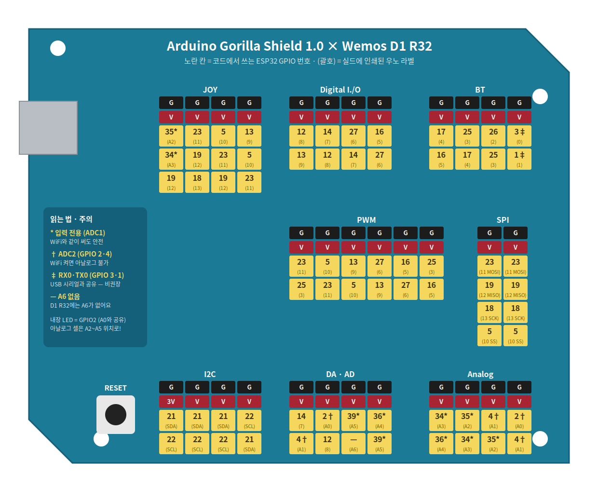

# Wemos D1 R32 핀맵 — 보드 라벨 vs GPIO 번호

> ⚠️ **가장 중요한 규칙**: 보드에 인쇄된 이름(D2, A0 …)과
> **코드에서 쓰는 GPIO 번호는 다릅니다.**
> 코드는 언제나 **GPIO 번호** 기준이에요. 이 표(또는 배포된 포트-핀맵 카드)를 항상 옆에 두세요.
>
> 실물 사진·핀맵 이미지: [`../images/`](../images/) 폴더 (`wemosD1R32 pinmap.jpg`)
> **고릴라 실드를 꽂았을 때의 포트별 GPIO 변환 그림(= 포트-핀맵 카드)**:
> [`gorilla_shield_x_d1r32_pinmap.png`](../images/gorilla_shield_x_d1r32_pinmap.png) ([SVG 원본](../images/gorilla_shield_x_d1r32_pinmap.svg))

## 고릴라 실드 포트 ↔ GPIO 변환 그림

- 노란 칸 = **코드에서 쓰는 ESP32 GPIO 번호**, (괄호) = 실드에 인쇄된 우노 라벨
- `*` 입력 전용(ADC1 — WiFi와 같이 써도 안전) · `†` ADC2(GPIO 2·4 — WiFi 켜면 아날로그 불가)
- `‡` RX0·TX0(GPIO 3·1 — USB 시리얼과 공유, 사용 비권장) · `—` A6 없음
- ⚠ I2C 포트의 21(SDA)·22(SCL)은 실드가 우노 R3 상단 SDA·SCL 핀을 쓰는 경우예요.
  만약 실드가 아날로그 A4·A5 라인만 쓴다면 D1 R32에서는 GPIO 36·39(입력 전용)가 되어 **I2C가 동작하지 않으니**, LCD가 안 되면 이 배선부터 확인!

## 아날로그 (Analog) 헤더

| 보드 라벨 | GPIO | ADC | WiFi와 같이 써도 되나? | 메모 |
|:---:|:---:|:---:|:---:|---|
| A0 | GPIO2 | ADC2 | ❌ **불가** | 내장 LED와 공유 |
| A1 | GPIO4 | ADC2 | ❌ **불가** | |
| **A2** | **GPIO35** | ADC1 | ✅ 가능 | 입력 전용 |
| **A3** | **GPIO34** | ADC1 | ✅ 가능 | 입력 전용 |
| **A4** | **GPIO36** | ADC1 | ✅ 가능 | 입력 전용 (SVP) |
| **A5** | **GPIO39** | ADC1 | ✅ 가능 | 입력 전용 (SVN) |

> 🔑 **아날로그 센서 셀은 A2~A5 위치에!**
> ESP32의 ADC2(A0·A1 자리)는 **WiFi를 켜면 아날로그 읽기가 멈춥니다.**
> 3회차부터는 WiFi를 항상 쓰니까, 처음부터 A2~A5(GPIO 34·35·36·39)에 꽂는 습관을 들여요.
> (34·35·36·39는 **입력 전용** — 출력(digitalWrite)은 안 됩니다)

## 디지털 (Digital) 헤더

| 보드 라벨 | GPIO | 특수 기능 | 메모 |
|:---:|:---:|:---|---|
| D2 | GPIO26 | DAC2 | 범용 (예: 릴레이) |
| D3 | GPIO25 | DAC1 | 범용 |
| D4 | GPIO17 | U2-TX | 범용 |
| D5 | GPIO16 | U2-RX | 범용 |
| D6 | GPIO27 | | 범용 |
| D7 | GPIO14 | | 범용 |
| D8 | GPIO12 | | ⚠ 부팅 시 상태 민감 — 가급적 비우기 |
| D9 | GPIO13 | | 범용 |
| D10 | GPIO5 | SPI **SS** | |
| D11 | GPIO23 | SPI **MOSI** | |
| D12 | GPIO19 | SPI **MISO** | |
| D13 | GPIO18 | SPI **SCK** | |
| TX0 | GPIO1 | USB 시리얼 | ❌ 사용 금지 (업로드·시리얼 모니터용) |
| RX0 | GPIO3 | USB 시리얼 | ❌ 사용 금지 |

## I2C (SDA·SCL)

| 보드 라벨 | GPIO | 용도 |
|:---:|:---:|---|
| SDA | GPIO21 | I2C 데이터 |
| SCL | GPIO22 | I2C 클럭 |

> ⚠ **본 과정은 LCD(I2C)를 사용하지 않아요** — 숫자 표시는 7세그(TM1637)!
> 실드의 I2C 블록이 우노의 A4·A5 라인에 연결된 경우, D1 R32에서는 GPIO36·39(입력 전용)가 되어
> I2C가 동작하지 않습니다. I2C 셀을 꼭 써야 하면 **디지털 포트에 꽂고 `Wire.begin(핀, 핀)`** 으로 지정하세요
> (예: '6'·'7' 칸 → `Wire.begin(27, 14);`).

## 그 밖에 기억할 것

- **내장 LED = GPIO2** (파란색) — 모든 실습의 "동작 확인용 신호등"
- **내장 버튼**: EN(리셋), IO0(BOOT — 업로드가 `Connecting...`에서 멈출 때만 사용)
- 동작 전압 **3.3V** — 핀에 5V를 직접 넣지 마세요
- 고릴라 실드를 쓰면 포트 위치가 곧 핀 번호를 정해요 → **배포된 포트-핀맵 카드가 최종 기준**

## 수업에서 자주 쓰는 핀 정리 (빠른 참조)

| 용도 | GPIO | 위치 |
|---|:---:|---|
| 내장 LED | 2 | 보드 내장 |
| 빛·토양습도 등 아날로그 셀 | 34 (또는 35·36·39) | A2~A5 포트 |
| 7세그 DIO·CLK | 27 · 14 | '6'·'7' 칸 (신호 2칸 포트) |
| 진동·홀 등 디지털 셀 | 27 등 | 디지털 포트 (핀맵 카드 확인) |
| 릴레이 (화분 펌프) | 26 | D2 |
| 초음파 TRIG / ECHO | 핀맵 카드 확인 | 디지털 포트 |
