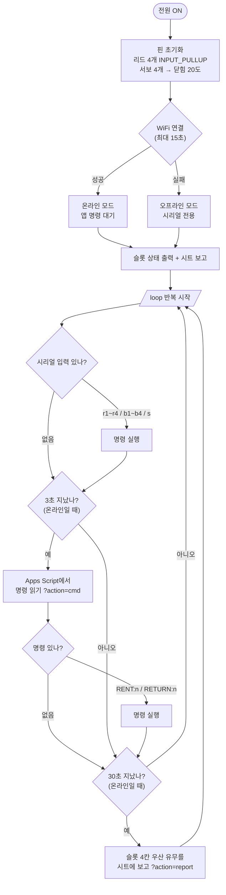
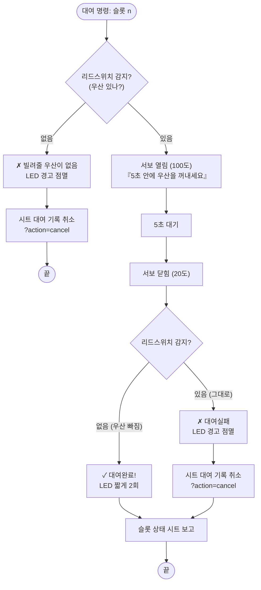
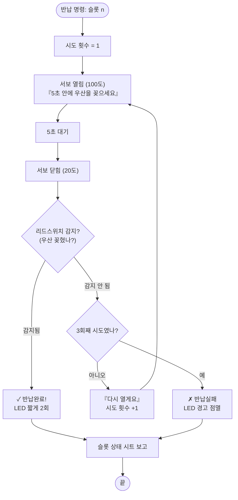

# 스마트 보관함 — 실행 로직 순서도

`step5_locker.ino`가 실행되는 순서를 그림으로 정리했습니다.
(GitHub에서 이 파일을 열면 순서도가 그림으로 보여요)

## ① 전체 구조 — 부팅(setup)과 반복(loop)

## ② 대여 (doRent) — `RENT:n` 또는 시리얼 `rn`

## ③ 반납 (doReturn) — `RETURN:n` 또는 시리얼 `bn`

## 한눈에 보는 핵심 규칙

| 상황 | 판정 기준 | 결과 |
|---|---|---|
| 대여 후 우산 없음 | 리드 감지 안 됨 | ✓ 대여완료 |
| 대여 후 우산 그대로 | 리드 감지됨 | ✗ 대여실패 → 시트 자동 취소 |
| 반납 후 우산 감지 | 리드 감지됨 | ✓ 반납완료 |
| 반납 후 우산 없음 | 리드 감지 안 됨 | 다시 열림 (최대 3회) → 그래도 없으면 ✗ 반납실패 |

- 열림 100도 / 닫힘 20도, 열려 있는 시간 5초 — 코드 상단 상수로 조정
- 명령은 앱(Apps Script 큐, 3초 폴링)과 시리얼(r/b/s) 두 경로 모두 같은 함수로 처리
