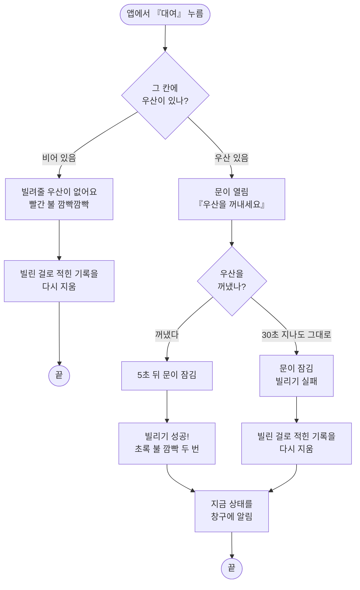
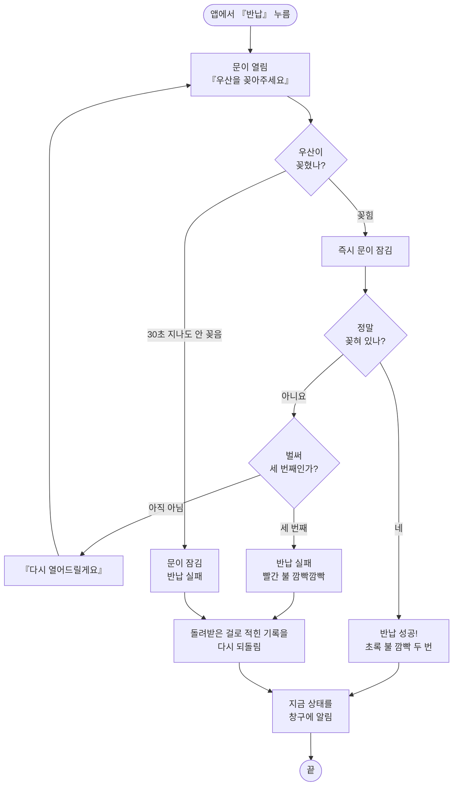
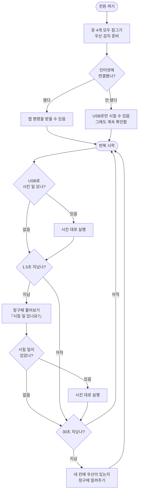

# 스마트 우산 보관함 — 어떻게 움직이나

우산을 빌리고 돌려주는 과정을 그림으로 풀었습니다.
**기계 용어 없이** 읽을 수 있게 썼어요. (GitHub에서 열면 그림으로 보입니다)

> 코드 속 용어와 짝지어 보고 싶다면 → 맨 아래 [용어 짝꿍표](#용어-짝꿍표)

---

## 1. 한눈에 보기

- **학생**은 앱에서 버튼만 누릅니다
- **인터넷 창구**가 누가 무엇을 빌렸는지 적어두고, 보관함에 시킬 일을 남깁니다
- **보관함**은 1.5초마다 "시킬 일 있나요?" 하고 물어보러 갑니다

---

## 2. 우산을 빌릴 때

> 💡 **왜 기록을 지우나요?**
> 문은 열렸는데 우산을 안 가져갔다면, 빌린 게 아니니까 요금을 물리면 안 되겠죠.
> 그래서 보관함이 "안 가져갔대요"라고 알려주고, 창구가 기록을 없던 일로 되돌립니다.

---

## 3. 우산을 돌려줄 때

> 💡 **왜 꽂히자마자 바로 닫나요?**
> 우산을 잡아주는 기구가 없어서, 기다리는 사이 우산이 기울거나 빠질 수 있어요.
> 감지되는 순간 닫는 게 가장 안전합니다.
>
> 💡 **왜 세 번이나 열어주나요?**
> 우산을 비뚤게 넣으면 기계가 못 알아볼 수 있어요.
> 그래서 바로 실패로 처리하지 않고 **두 번 더 기회**를 줍니다.
>
> 💡 **왜 기록을 되돌리나요?**
> 창구는 『반납』 버튼을 누른 순간 이미 "돌려받았고 요금도 냈다"고 적어둡니다.
> 그런데 우산이 실제로 안 들어왔다면 그건 사실이 아니죠. 그래서 보관함이
> "안 들어왔대요"라고 알려주고, 창구가 **다시 빌린 상태로 되돌립니다.**
> 이게 없으면 우산은 손에 있는데 창구는 빈 칸으로 알고, 다음 사람에게
> **빈 칸을 열어줍니다.**

---

## 4. 보관함이 평소에 하는 일

전원을 켜두면 아래를 계속 반복합니다.

- **1.5초마다** 창구에 "시킬 일 있나요?" 하고 물어봅니다 → 앱에서 누르면 2초 안에 문이 열려요
- **30초마다** 네 칸의 우산 유무를 창구에 알려줍니다 → 누가 몰래 꺼내가도 곧 티가 납니다
  - 이때 창구는 **적힌 것과 실제가 다른지도 확인**합니다. 빌린 사람이 없는데
    "빌려나감"으로 잠겨 있던 칸은 자동으로 풀어주고, 남은 칸 수도 다시 셉니다
- 인터넷이 안 되면 **USB로 연결한 컴퓨터**에서 직접 시킬 수 있습니다 (발표 때 비상용)

---

## 5. 성공·실패를 가르는 기준

기계는 **"우산이 꽂혀 있는지"** 하나만 봅니다. 문을 닫은 뒤 확인해서 판정해요.

| 언제 | 무엇을 보나 | 결과 |
|---|---|---|
| 빌릴 때 | 우산이 빠짐 → 5초 뒤 잠금 | ✅ 빌리기 성공 |
| 빌릴 때 | 30초 지나도 그대로 | ❌ 실패 → 요금 안 물림 |
| 돌려줄 때 | 우산이 꽂힘 → 즉시 잠금 | ✅ 반납 성공 |
| 돌려줄 때 | 잠근 뒤 다시 보니 비어 있음 | 🔁 다시 열어줌 (최대 3번) |
| 돌려줄 때 | 30초 지나도 안 꽂음 | ❌ 반납 실패 → 반납 기록을 되돌림 |

**불빛으로 알려주는 신호**

| 불빛 | 뜻 |
|---|---|
| 초록 불 깜빡 두 번 | 잘 됐어요 |
| 빨간 불 빠르게 깜빡깜빡 | 실패했어요 |

**바꾸고 싶으면** — 코드 맨 위 숫자만 고치면 됩니다

| 무엇 | 지금 값 |
|---|---|
| 우산을 꺼낸 뒤 잠그기까지 | 5초 |
| 아무 일 없을 때 자동 잠금 | 30초 |
| 다시 열어주는 횟수 | 3번 |
| 문 열린 각도 / 잠긴 각도 | 0도 / 180도 |

---

## 용어 짝꿍표

발표 자료나 코드를 볼 때 참고하세요.

| 이 문서의 말 | 코드·기술 용어 |
|---|---|
| 인터넷 창구 | 구글 시트 + Apps Script 서버 |
| 칸 (1~4번) | 슬롯 (slot_no) |
| 문을 열다 / 잠그다 | 서보모터를 0도 / 180도로 돌림 |
| 우산이 꽂혀 있나? | 리드스위치가 자석을 감지했나 (LOW면 있음) |
| 시킬 일 있나요? | 명령 큐 확인 (`?action=cmd&locker_id=L001` — 자기 보관함 것만) |
| 창구에 알려주기 | 상태 보고 (`?action=report`) |
| 기록을 다시 지움 | 대여 취소 (`?action=cancel`) |
| 기록을 다시 되돌림 | 반납 취소 (`?action=return_failed`) |
| USB로 시키기 | 시리얼 모니터에 `r`/`b`(대여·반납), `o`/`c`(열기·닫기), `s`(상태) + 슬롯 번호 |
| 초록 불 / 빨간 불 | 보드 내장 LED 점멸 패턴 |
