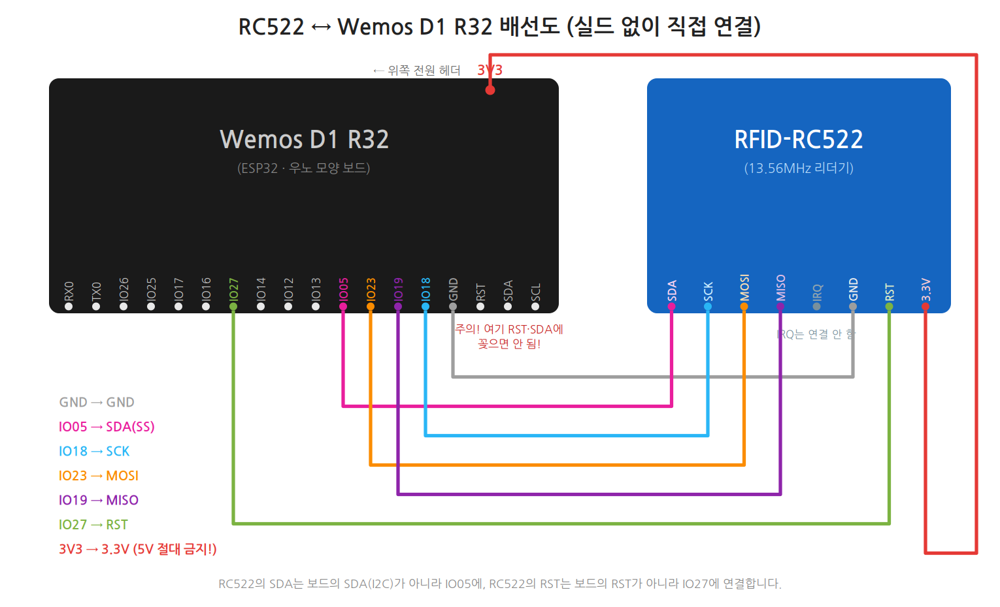

# 배선 — RC522 ↔ ESP32 (WROOM-32 DevKit / Wemos D1 R32)

## ⚠️ 가장 중요한 것 하나

**RC522는 반드시 3.3V에 연결!** 5V(VIN)에 꽂으면 모듈이 고장납니다.

## 배선표 (WROOM-32 DevKit)

| RC522 핀 | ESP32 핀 | 설명 |
|---|---|---|
| **3.3V** | **3V3** | 전원 (5V 절대 금지!) |
| **RST** | **GPIO 27** | 리셋 |
| **GND** | **GND** | 접지 |
| **IRQ** | (연결 안 함) | 사용하지 않음 |
| **MISO** | **GPIO 19** | SPI 데이터 (모듈→보드) |
| **MOSI** | **GPIO 23** | SPI 데이터 (보드→모듈) |
| **SCK** | **GPIO 18** | SPI 클럭 |
| **SDA(SS)** | **GPIO 5** | SPI 선택 |

MISO/MOSI/SCK는 ESP32의 기본 SPI(VSPI) 핀이라 코드에서 따로 지정하지 않습니다.

## 배선표 (Wemos D1 R32) — 실드 없이 보드에 직접

이 보드는 핀에 **GPIO 번호가 그대로 인쇄**되어 있습니다 (IO05, IO23 …).
코드의 핀 번호와 인쇄가 같으므로 **번호만 맞춰 꽂으면** 되고, 코드 수정도 없습니다.

([SVG 원본](images/rc522_wemos_d1_r32_wiring.svg) — 선 색깔은 아래 표와 같습니다)

| RC522 핀 | D1 R32 인쇄 라벨 | 위치 | 설명 |
|---|---|---|---|
| **3.3V** | **3V3** | 위쪽 전원 헤더 | 전원 (5V 절대 금지!) |
| **RST** | **IO27** | 아래쪽 디지털 헤더 | 리셋 |
| **GND** | **GND** | 아무 GND나 | 접지 |
| **IRQ** | (연결 안 함) | — | 사용하지 않음 |
| **MISO** | **IO19** | 아래쪽 디지털 헤더 | SPI 데이터 (모듈→보드) |
| **MOSI** | **IO23** | 아래쪽 디지털 헤더 | SPI 데이터 (보드→모듈) |
| **SCK** | **IO18** | 아래쪽 디지털 헤더 | SPI 클럭 |
| **SDA(SS)** | **IO05** | 아래쪽 디지털 헤더 | SPI 선택 |

⚠️ **헷갈리기 쉬운 함정 2개** (아래쪽 오른끝 `GND·RST·SDA·SCL` 구역):

1. RC522의 **SDA**는 보드의 **SDA 핀에 꽂는 게 아닙니다!**
   보드의 SDA·SCL은 I2C용(GPIO21·22)이고, RC522의 SDA(SS)는 **IO05**에 꽂아야 합니다.
2. RC522의 **RST**도 보드의 **RST 핀이 아닙니다!**
   보드의 RST는 보드 자체 리셋용이고, RC522의 RST는 **IO27**에 꽂아야 합니다.

추가 부품 (선택):

| 부품 | D1 R32 인쇄 라벨 | 위치 |
|---|---|---|
| 수동부저 (+) | **IO04** | 위쪽 아날로그 헤더 (ANALOG 쪽) |
| 수동부저 (−) | **GND** | 아무 GND나 |
| 상태 LED | 보드 내장 파란 LED (IO02) | 따로 달 필요 없음 |

> 참고: D1 R32 중에는 우노식 라벨(D10~D13, A1…)이 인쇄된 버전도 있습니다.
> 그 경우 SS=D10, MOSI=D11, MISO=D12, SCK=D13, RST=D6, 부저=A1 이 같은 핀입니다.
> 라벨↔GPIO 전체 대응표: [`../../esp32-class-projects/01_docs/pinmap_wemos_d1_r32.md`](../../esp32-class-projects/01_docs/pinmap_wemos_d1_r32.md)

## 추가 부품 (선택)

| 부품 | ESP32 핀 | 설명 |
|---|---|---|
| 수동부저 (+) | **GPIO 4** | 성공 삑삑 / 실패 삐— 소리. 없어도 동작함 |
| 수동부저 (−) | GND | |
| 상태 LED | **GPIO 2** | 보드 내장 파란 LED 사용 — 따로 달 필요 없음 |

LED 동작: 대기 중 꺼짐 → 출석 세션 **천천히 깜빡**(0.5초) → 등록 세션 **빠르게 깜빡**(0.15초) → 태그 처리 중 켜짐.

## 업로드 설정 (Arduino IDE)

- 보드: **ESP32 Dev Module**
- 라이브러리: 라이브러리 매니저에서 **MFRC522** (by GithubCommunity) 설치
- 업로드 속도가 불안하면 921600 → 115200으로 낮추기

## 배선 확인 방법

[`../firmware/uid_test/`](../firmware/uid_test/) 를 업로드하고 시리얼 모니터(115200)를 여세요.

- `RC522 버전 레지스터: 0x92` (또는 0x91, 0x12 등) → 정상
- `0x00` 또는 `0xFF` → 배선 오류. 3.3V·SDA(5번)·RST(27번)를 다시 확인
- 정상인데 카드가 인식 안 되면 → 그 카드가 Type A가 아닐 수 있음 (README의 학생증 안내 참고)
